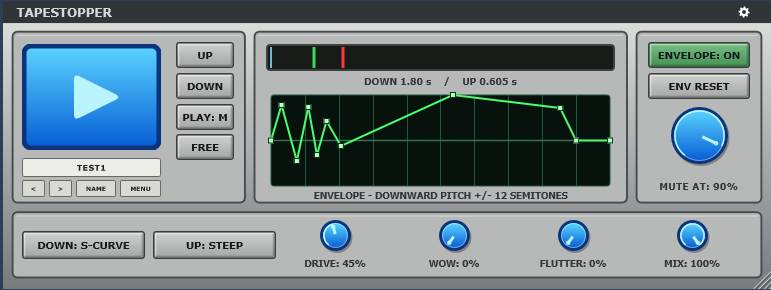

# TapeStopper

[](https://github.com/sl2365/TapeStopper/releases/latest/download/TapeStopper.rar)
[](https://github.com/sl2365/TapeStopper/releases)

[](https://github.com/sl2365/TapeStopper/releases/latest)
[](https://github.com/sl2365/TapeStopper/releases)

[](https://github.com/sl2365/TapeStopper/activity)
[](https://github.com/sl2365/TapeStopper/activity)

TapeStopper is a portable Windows x64 VST3 audio effect for tape-style slowdown and startup transitions. It combines independently timed DOWN and UP motion with tempo sync, editable Pitch, Filter and Volume curves, a separate global 11-point Envelope, a 64-step Play sequencer, a persistent transition display, saturation, wow, flutter, irregular flux instability, wet/dry mix, threshold muting and portable user presets.

The interface is inspired by the TapeStop effect by TBT (Daniel Lind) and SLowER by DiVerSe. I was unable to find any sites remaining for either, only posts made on KVR audio.



## Features

- Buffered tape slowdown and startup processing.
- Momentary and Toggle operation for the main Play button.
- One-click RETRIG pulse that jumps instantly to stopped speed and then runs UP.
- Independently enabled DOWN and UP transitions.
- Separate DOWN and UP transition times.
- FREE timing from 0.05 to 8.00 seconds.
- Host-tempo SYNC timing from 4 bars to 1/64 notes.
- Independent five-point DOWN and UP curves for Pitch, Filter and Volume.
- Four graph views selected by compact Pitch, Filter, Volume and Envelope tabs.
- Blue Pitch, orange Filter, purple Volume and green Envelope controls with individual On/Off LEDs.
- Editable global 11-point downward Envelope retained separately from the simple curves.
- Filter Amount and Volume Amount controls.
- 64-step Play sequencer arranged as two rows of 32 steps.
- Separate sequencer-view button and enable LED, so opening the editor never starts sequencing.
- Host-tempo Sync clock or tempo-independent Free clock.
- Adjustable sequencer Rate, Length and Offset with a one-click pattern Reset.
- Optional red transition trace behind the envelope graph. It plots effective tape speed over the complete DOWN or UP movement and remains visible afterward.
- Adjustable Mute At transition threshold.
- Tape-style Drive, Wow and Flutter controls.
- Strong FLUX control for irregular pitch warble and playback errors during DOWN and UP. It fluctuates around the envelope-shaped pitch when the envelope is enabled, or around the normal tape curve when it is bypassed.
- Dry/processed Mix control.
- Full Speed Mute option for send-effect use.
- Normal or Reversed main-button icon display.
- Portable INI presets with INIT, previous/next, rename, Save, Save As and Load.
- Resizable 800 x 300 interface from 75% to 200%, with a fixed aspect ratio.
- Portable settings and presets stored beside the VST3.
- Mono and stereo audio layouts.

For a detailed description of every control, see [Instructions.ini](Instructions.ini).

## Quick use

1. Load `TapeStopper.vst3` as an audio effect.
2. Leave `PLAY: M` selected to use the large blue button momentarily, or select `PLAY: T` for toggle operation.
3. Set the DOWN time with the green marker using the left mouse button.
4. Set the UP time with the red marker using the right mouse button.
5. Press the large blue button to slow and stop the audio. Release it, or press it again in Toggle mode, to return to full speed.

Alternatively, click `RETRIG` to pulse instantly to stopped speed and recover using the current UP settings, without holding or toggling the main Play button.

The green DOWN marker and red UP marker can be adjusted only on the timing track. The readout underneath the track is informational and cannot move the markers.

## Timing modes

In FREE mode, the two timing markers select continuous transition times between 0.05 and 8.00 seconds. Moving a marker left produces a longer/slower transition; moving it right produces a shorter/faster transition.

In SYNC mode, the markers snap independently to:

`4 BAR`, `2 BAR`, `1 BAR`, `1/2`, `1/2T`, `1/4`, `1/4T`, `1/8`, `1/16`, `1/16T`, `1/32`, `1/32T`, `1/64`

SYNC timing follows tempo information supplied by the host. FREE and SYNC values are retained separately when switching modes.

## Curves and Envelope

The central graph always retains the red transition trace and can display one editable view at a time. Click the LED beside a tab to enable or bypass that function; click the tab name to select its graph without changing whether it is enabled.

The red trace always represents the resulting tape speed/pitch. It does not change into a Filter cutoff or Volume-level trace when those views are selected; their coloured curves show those control paths directly.

Pitch, Filter and Volume each have separate DOWN and UP curves. Their five control points stay equally spaced horizontally at 1/6 intervals (approximately 16.7%, 33.3%, 50%, 66.7% and 83.3%) but move freely up and down. Smooth interpolation allows gentle, steep, S-shaped and non-standard movement with finer shaping than the earlier three-point curves.

The paired curves remain visually distinct: Pitch uses cyan DOWN and blue UP, Filter uses orange DOWN and brown UP, and Volume uses violet DOWN and indigo UP.

- Left-drag square points to edit DOWN.
- Right-drag circular points to edit UP.
- Double-click the graph with the left or right mouse button to reset that direction to Linear.
- `CURVE RESET` resets both directions in the selected Pitch, Filter or Volume view.
- Pitch Off bypasses the tape-speed change while Filter and Volume curves can continue running.
- Filter Amount controls how far the low-pass filter closes, with the selected curve directly shaping its logarithmic cutoff sweep.
- Volume Amount controls the maximum level reduction.

The green Envelope view is the existing global 11-point downward pitch/scratch modulation. Its first and last points move vertically; the middle nine also move horizontally without crossing. Double-clicking one point returns it to zero semitones. `ENV RESET` centres all eleven points while preserving their time positions.

## Step sequencer

The `SEQ` button at the bottom-left switches the bottom panel between the seven tape controls and the sequencer. The small blue LED beside `SEQ` independently enables or disables sequencer control; opening or closing the view does not alter that enabled state.

The 64 steps are arranged as two rows of 32. Click a square to toggle it, or click and drag across several squares to paint the same On or Off state. Enabled steps hold the main Play button for the complete step; adjacent enabled steps therefore form a longer continuous trigger.

- `SYNC` follows host tempo and offers `1/2`, `1/4`, `1/8`, `1/8T`, `1/16`, `1/16T`, `1/32`, `1/32T`, `1/64`, `1/64T` and `1/128` step rates.
- `FREE` ignores tempo and offers step durations from 25 to 2000 ms.
- `LEN` sets the repeating pattern length from 1 to 64 steps.
- `OFF` offsets the pattern start by 0 to 63 steps.
- `RESET` clears all 64 steps.

Left-click a sequencer control to move forward through its values and right-click to move backward. The mouse wheel also adjusts `SYNC/FREE`, `RATE`, `LEN` and `OFF`. Rate, Length and Offset stop at their smallest and largest values instead of wrapping around. The sequencer runs only while the host transport is playing; when its LED is Off, the main Play button operates normally.

## Presets and portable data

User presets are saved as INI files in:

```text
Data\Presets
```

The folder is created beside the loaded VST3. Presets store the sound controls, all six simple curves, their enables and amounts, timing choices, direction enables, Play mode, every global Envelope point and the complete sequencer pattern and settings. They do not store the temporary pressed state of the large Play button, the currently displayed graph tab, the open/closed sequencer view or the global Setup options.

Portable editor and Setup options are saved in:

```text
Data\Settings.ini
```

This stores the editor scale, Full Speed Mute setting, Normal/Reversed button display choice and Waveform display choice. No settings or presets are written to the Windows user profile.

## Building

The supplied build script expects this directory arrangement:

```text
_Projects\TapeStopper\
_Tools\cmake\_4.4.2\
_Tools\JUCE\_8.0.15\
```

Visual Studio 18 2026 with the x64 C++ tools is required.

1. Open the TapeStopper Project Root in File Explorer.
2. Double-click `- Build.bat`.
3. Wait for the build summary to report PASS.
4. Load `dist\TapeStopper.vst3` in the host.

The build creates a portable single-file Windows x64 VST3 and preserves an existing `dist\Data` folder. It does not install the plug-in elsewhere. Detailed build output is written to `Results.log`.

## Project files

- `source` - C++ and CMake source files.
- `- Build.bat` - one-click Windows x64 Release build.
- `Instructions.ini` - complete control reference.
- `README-dev.md` - detailed stage behaviour and development notes.

## Development status

TapeStopper is still under development. Its bundle ID and four-character VST identity codes are provisional and should be replaced with permanent approved identifiers before a compatibility-sensitive public release. Changing those identifiers later will cause hosts to recognise the plug-in as a different product.
